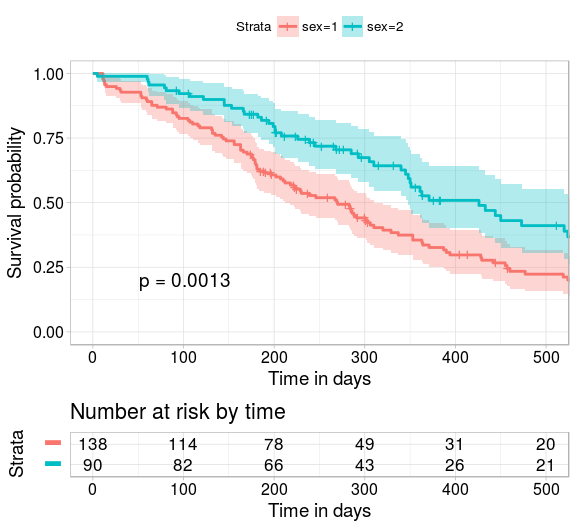
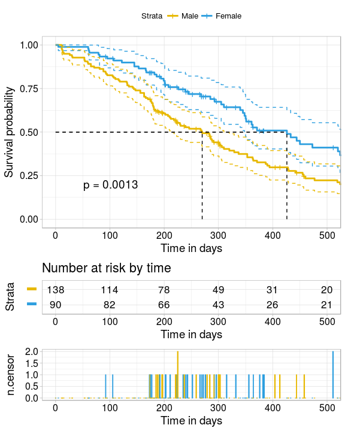

[](https://travis-ci.org/kassambara/survminer) [](https://cran.r-project.org/package=survminer) [](https://cran.r-project.org/package=survminer) [](http://cranlogs.r-pkg.org/badges/grand-total/survminer) [](http://www.repostatus.org/#active) [](https://github.com/kassambara/survminer/pulls) [](https://github.com/kassambara/survminer/issues)

survminer: Survival Analysis and Visualization
==============================================

The **survminer** R package provides functions for facilitating **survival analysis** and **visualization**. The current version contains three main functions including:

-   **ggsurvplot**(): Draws survival curves with the 'number at risk' table.

-   **ggcoxzph**(): Graphical test of proportional hazards.

-   **ggcoxfunctional**(): Displays graphs of continuous explanatory variable against martingale residuals of null cox proportional hazards model. It helps to properly choose the functional form of continuous variable in cox model.

Find out more at <http://www.sthda.com/english/rpkgs/survminer/>, and check out the documentation and usage examples of each of the functions in survminer package.

Installation and loading
------------------------

Install from [CRAN](https://cran.r-project.org/package=survminer) as follow:

``` r
install.packages("survminer")
```

Or, install the latest version from [GitHub](https://github.com/kassambara/survminer):

``` r
# Install
if(!require(devtools)) install.packages("devtools")
devtools::install_github("kassambara/survminer", build_vignettes = FALSE)
```

Load survminer:

``` r
library("survminer")
# Loading required package: ggplot2
# Warning: package 'ggplot2' was built under R version 3.3.2
```

ggsurvplot: Drawing survival curves
-----------------------------------

-   **Fitting survival curves**

``` r
require("survival")
# Loading required package: survival
fit <- survfit(Surv(time, status) ~ sex, data = lung)
```

-   **Basic plots**

``` r
ggsurvplot(fit)
```


-   **Customized survival curves**

``` r
ggsurvplot(fit,  size = 1,  # change line size
           palette = c("#E7B800", "#2E9FDF"), # custom color palettes
           conf.int = TRUE, # Add confidence interval
           pval = TRUE, # Add p-value
           risk.table = TRUE, # Add risk table
           risk.table.col = "strata", # Risk table color by groups
           legend.labs = c("Male", "Female"), # Change legend labels
           risk.table.height = 0.25, # Useful to change when you have multiple groups
           ggtheme = theme_bw() # Change ggplot2 theme
           )
```


Note that, additional arguments are available to customize the main title, axis labels, the font style, axis limits, legends and the number at risk table.

-   **More customized survival curves**

Focus on `xlim` and `break.by.time` parameters which do not change the calculations of estimates of survival surves. Also note `risk.table.y.text.col = TRUE` and `risk.table.y.text = FALSE` that provide bars instead of names in text annotations of the legend of risk table.

``` r
ggsurvplot(
   fit,                     # survfit object with calculated statistics.
   risk.table = TRUE,       # show risk table.
   pval = TRUE,             # show p-value of log-rank test.
   conf.int = TRUE,         # show confidence intervals for 
                            # point estimaes of survival curves.
   xlim = c(0,500),         # present narrower X axis, but not affect
                            # survival estimates.
   xlab = "Time in days",   # customize X axis label.
   break.time.by = 100,     # break X axis in time intervals by 500.
   ggtheme = theme_light(), # customize plot and risk table with a theme.
 risk.table.y.text.col = T, # colour risk table text annotations.
  risk.table.y.text = FALSE # show bars instead of names in text annotations
                            # in legend of risk table
)
```



-   **Uber customized survival curves**

``` r
ggsurvplot(
   fit,                     # survfit object with calculated statistics.
   risk.table = TRUE,       # show risk table.
   pval = TRUE,             # show p-value of log-rank test.
   conf.int = TRUE,         # show confidence intervals for 
                            # point estimaes of survival curves.
   xlim = c(0,500),         # present narrower X axis, but not affect
                            # survival estimates.
   xlab = "Time in days",   # customize X axis label.
   break.time.by = 100,     # break X axis in time intervals by 500.
   ggtheme = theme_light(), # customize plot and risk table with a theme.
  risk.table.y.text.col = T,# colour risk table text annotations.
  risk.table.y.text = FALSE,# show bars instead of names in text annotations
                            # in legend of risk table.
  ncensor.plot = TRUE,      # plot the number of censored subjects at time t
  conf.int.style = "step",  # customize style of confidence intervals
  surv.median.line = "hv",  # add the median survival pointer.
  legend.labs = 
    c("Male", "Female"),    # change legend labels.
  palette = 
    c("#E7B800", "#2E9FDF") # custom color palettes.
)
```



Blog posts
----------

-   M. Kosiński. R-ADDICT November 2016. [Determine optimal cutpoints for numerical variables in survival plots](http://r-addict.com/2016/11/21/Optimal-Cutpoint-maxstat.html)

-   M. Kosiński. R-ADDICT May 2016. [Survival plots have never been so informative](http://r-addict.com/2016/05/23/Informative-Survival-Plots.html)

-   A. Kassambara. STHDA January 2016. [survminer R package: Survival Data Analysis and Visualization](http://www.sthda.com/english/wiki/survminer-r-package-survival-data-analysis-and-visualization).
