[](http://cran.r-project.org/package=survminer)

survminer: Survival Analysis and Visualization
==============================================

The **survminer** R package provides functions for facilitating **survival analysis** and **visualization**. The current version contains the function **ggsurvplot()** for easily drawing beautiful survival curves using **ggplot2**. **ggsurvplot()** includes also some options for displaying the **p-value** and the **'number at risk' table**, under the survival curves.

Find out more at <http://www.sthda.com/english/wiki/survminer>.

Installation and loading
------------------------

Install from CRAN as follow:

``` r
install.packages("survminer")
```

Or, install the latest version from GitHub:

``` r
# Install
if(!require(devtools)) install.packages("devtools")
devtools::install_github("kassambara/survminer")
```

``` r
# Loading
library("survminer")
# Loading required package: ggplot2
```

Getting started
---------------

``` r
#%%%%%%%%%%%%%%%%%%%%%%%%%%%%%%%%%%%%%
# Example 1: Survival curve with one group
#%%%%%%%%%%%%%%%%%%%%%%%%%%%%%%%%%%%%%

require("survival")
# Loading required package: survival
fit <- survfit(Surv(time, status) ~ 1, data = lung)
ggsurvplot(fit, color = "#2E9FDF")
```

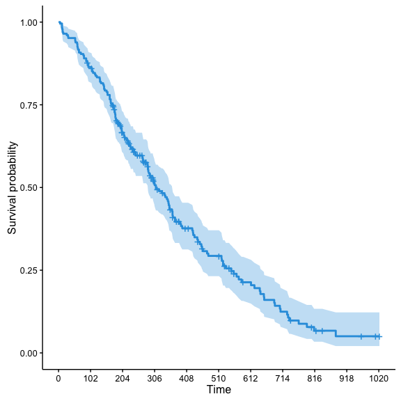<!-- -->

``` r


#%%%%%%%%%%%%%%%%%%%%%%%%%%%%%%%%%%%%%
# Example 2: Survival curves with two groups
#%%%%%%%%%%%%%%%%%%%%%%%%%%%%%%%%%%%%%

# Fit survival curves
#++++++++++++++++++++++++++++++++++++
require("survival")
fit<- survfit(Surv(time, status) ~ sex, data = lung)

# Drawing survival curves
ggsurvplot(fit)
```

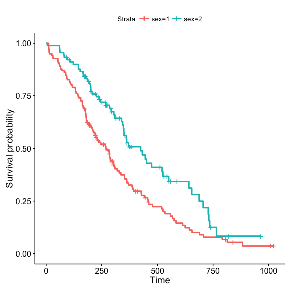<!-- -->

``` r


# Change font style, size and color
#++++++++++++++++++++++++++++++++++++
# Change only font size
ggsurvplot(fit, main = "Survival curve",
   font.main = 18,
   font.x =  16,
   font.y = 16,
   font.tickslab = 14)
```

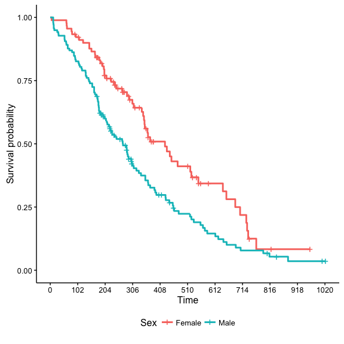<!-- -->

``` r

# Change font size, style and color at the same time
ggsurvplot(fit, main = "Survival curve",
   font.main = c(16, "bold", "darkblue"),
   font.x = c(14, "bold.italic", "red"),
   font.y = c(14, "bold.italic", "darkred"),
   font.tickslab = c(12, "plain", "darkgreen"))
```

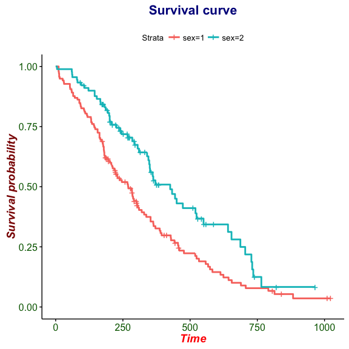<!-- -->

``` r

# Legend: title, labels and position
#++++++++++++++++++++++++++++++++++++

# Change the legend title and labels
ggsurvplot(fit, legend = "bottom", 
           legend.title = "Sex",
           legend.labs = c("Male", "Female"))
```

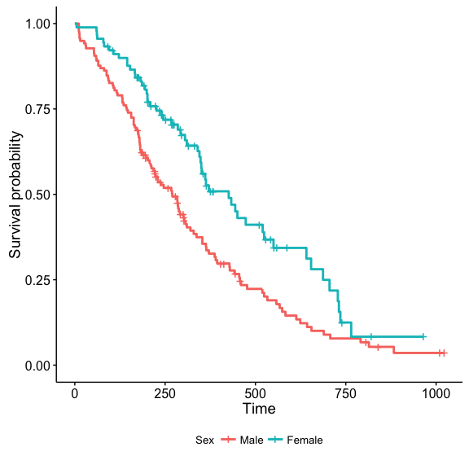<!-- -->

``` r

# Specify legend position by its coordinates
ggsurvplot(fit, legend = c(0.2, 0.2))
```

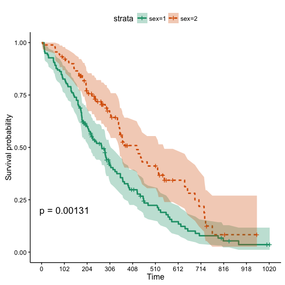<!-- -->

``` r


# format
#++++++++++++++++++++++++++++++++++++
# change line size --> 1
# Change line types by groups (i.e. "strata")
# and change color palette
ggsurvplot(fit,  size = 1,  # change line size
           linetype = "strata", # change line type by groups
           break.time.by = 250, # break time axis by 250
           palette = c("#E7B800", "#2E9FDF"), # custom color palette
           conf.int = TRUE, # Add confidence interval
           pval = TRUE # Add p-value
           )
```

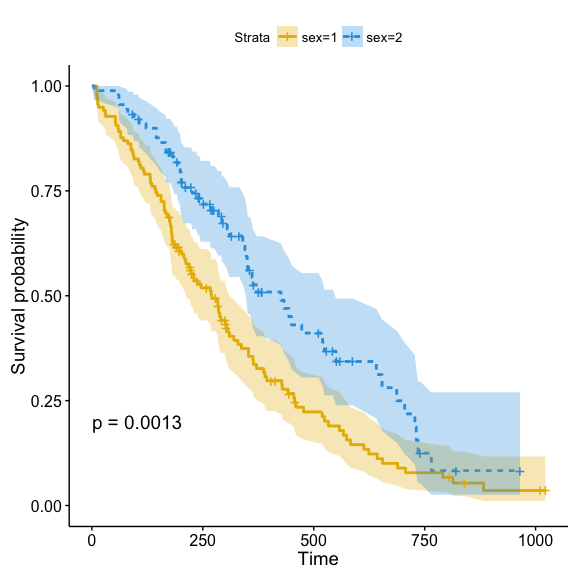<!-- -->

``` r

# Use brewer color palette "Dark2"
ggsurvplot(fit, linetype = "strata", 
           conf.int = TRUE, pval = TRUE,
           palette = "Dark2")
```

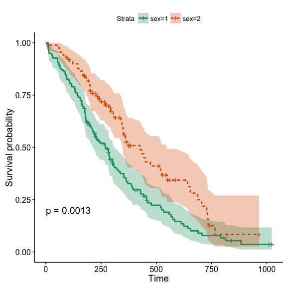<!-- -->

``` r

# Use grey palette
ggsurvplot(fit, linetype = "strata", 
           conf.int = TRUE, pval = TRUE,
           palette = "grey")
```

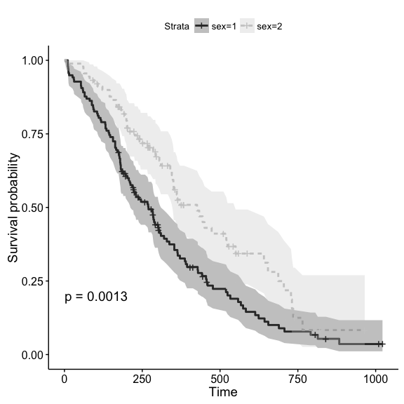<!-- -->

``` r

# Add risk table
#++++++++++++++++++++++++++++++++++++

# Add risk table
# and change risk table y text colors by strata
ggsurvplot(fit, pval = TRUE, conf.int = TRUE,
           risk.table = TRUE, risk.table.y.text.col = TRUE)
```

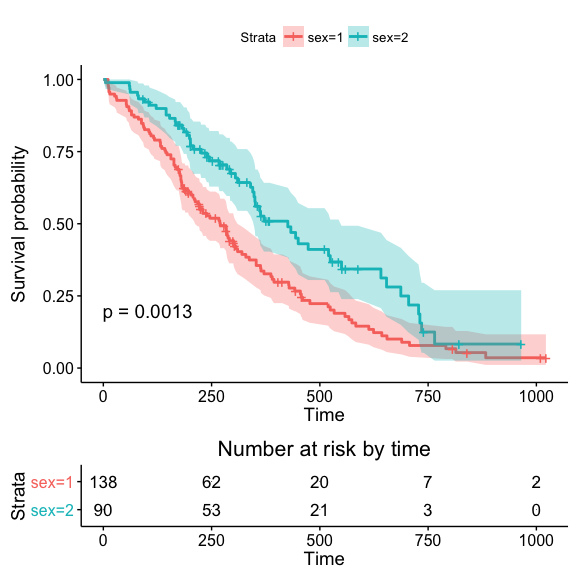<!-- -->

``` r

# Customize the output and then print
res <- ggsurvplot(fit, pval = TRUE, conf.int = TRUE,
           risk.table = TRUE)
res$table <- res$table + theme(axis.line = element_blank())
res$plot <- res$plot + labs(title = "Survival Curves")
print(res)
```

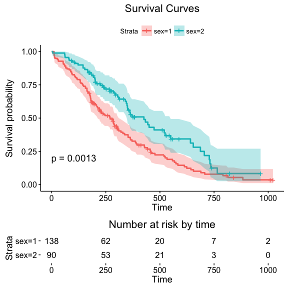<!-- -->

``` r

# Change color, linetype by strata, risk.table color by strata
ggsurvplot(fit, 
           pval = TRUE, conf.int = TRUE,
           risk.table = TRUE, # Add risk table
           risk.table.col = "strata", # Change risk table color by groups
           linetype = "strata", # Change line type by groups
           ggtheme = theme_bw(), # Change ggplot2 theme
           palette = c("#E7B800", "#2E9FDF"))
```

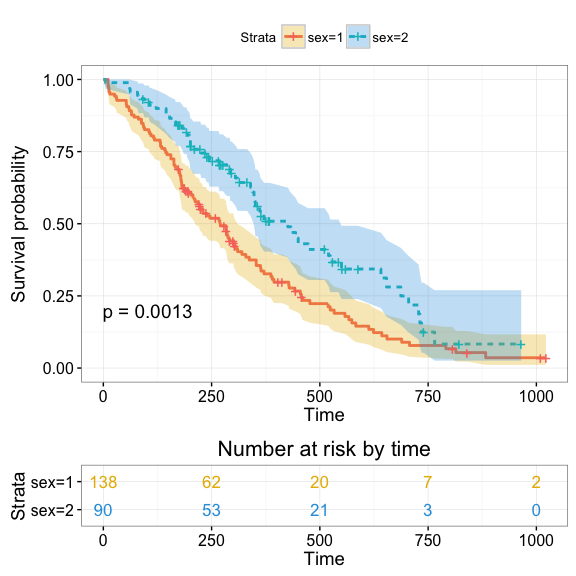<!-- -->

``` r


# Change x axis limits (xlim)
#++++++++++++++++++++++++++++++++++++
# One would like to cut axes at a specific time point
ggsurvplot(fit, 
           pval = TRUE, conf.int = TRUE,
           risk.table = TRUE, # Add risk table
           risk.table.col = "strata", # Change risk table color by groups
           ggtheme = theme_bw(), # Change ggplot2 theme
           palette = "Dark2",
           xlim = c(0, 600))
```

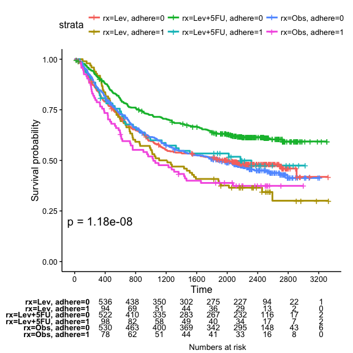<!-- -->

``` r


# Survival curve transformation
#++++++++++++++++++++++++++++++++++++
# Plot cumulative events
ggsurvplot(fit, conf.int = TRUE,
           palette = c("#FF9E29", "#86AA00"),
           risk.table = TRUE, risk.table.col = "strata",
           fun = "event")
```

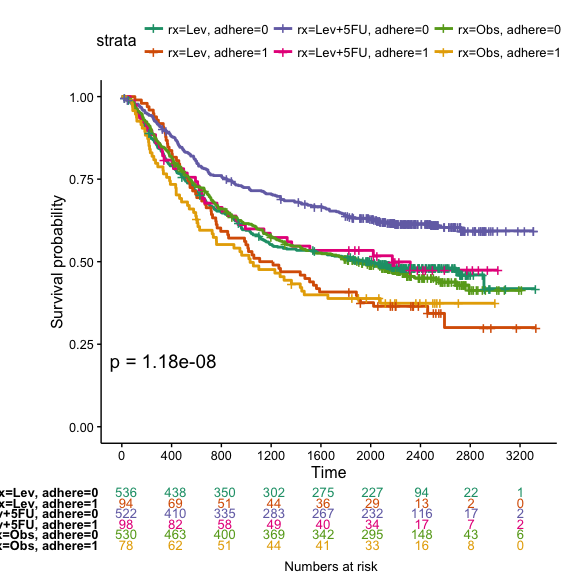<!-- -->

``` r

# Plot the cumulative hazard function
ggsurvplot(fit, conf.int = TRUE, 
           palette = c("#FF9E29", "#86AA00"),
           risk.table = TRUE, risk.table.col = "strata",
           fun = "cumhaz")
```

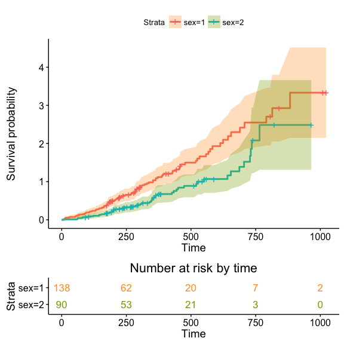<!-- -->

``` r

# Arbitrary function
ggsurvplot(fit, conf.int = TRUE, 
          palette = c("#FF9E29", "#86AA00"),
           risk.table = TRUE, risk.table.col = "strata",
           pval = TRUE,
           fun = function(y) y*100)
```

<!-- -->

``` r


#%%%%%%%%%%%%%%%%%%%%%%%%%%%%%%%%%%%%%
# Example 3: Survival curve with multiple group
#%%%%%%%%%%%%%%%%%%%%%%%%%%%%%%%%%%%%%

# Fit (complexe) survival curves
#++++++++++++++++++++++++++++++++++++

require("survival")
fit2 <- survfit( Surv(time, status) ~ rx + adhere,
    data = colon )

# Visualize
#++++++++++++++++++++++++++++++++++++

# Visualize: add p-value, chang y limits
# change color using brewer palette
ggsurvplot(fit2, pval = TRUE, 
           break.time.by = 400,
           risk.table = TRUE)
```

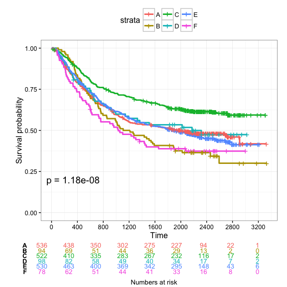<!-- -->

``` r

# Adjust risk table and survival plot heights
# ++++++++++++++++++++++++++++++++++++
# Risk table height
ggsurvplot(fit2, pval = TRUE,
          break.time.by = 400,
          risk.table = TRUE,
          risk.table.col = "strata",
          risk.table.height = 0.5, # Useful when you have multiple groups
          palette = "Dark2")
```

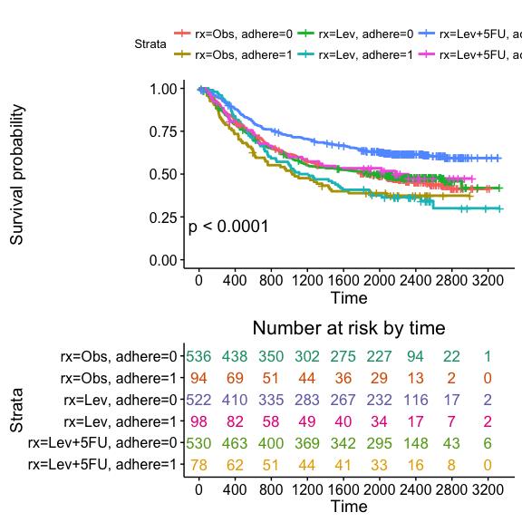<!-- -->

``` r
  
# Change legend labels
# ++++++++++++++++++++++++++++++++++++

ggsurvplot(fit2, pval = TRUE, 
           break.time.by = 400,
           risk.table = TRUE,
           risk.table.col = "strata",
           ggtheme = theme_bw(),
           legend.labs = c("A", "B", "C", "D", "E", "F"))
```

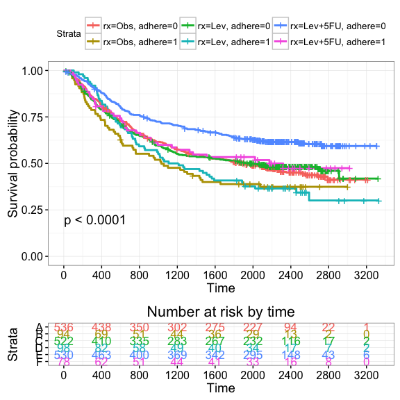<!-- -->
