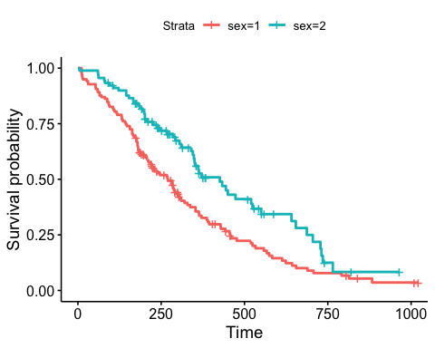
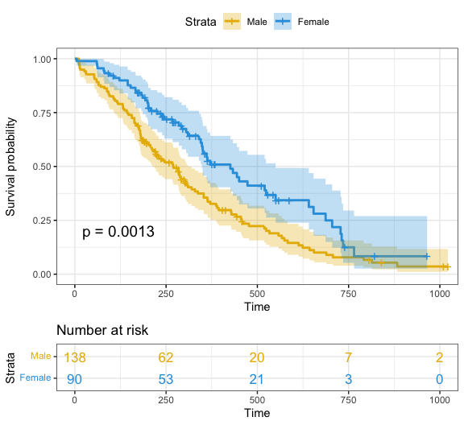
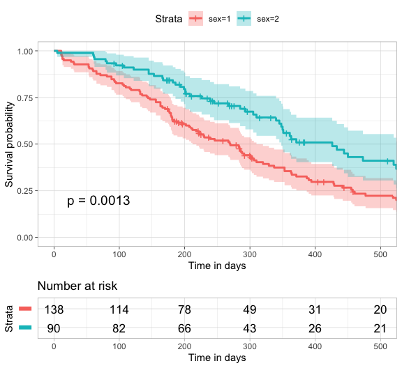
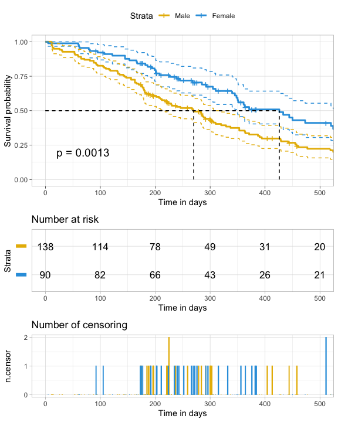
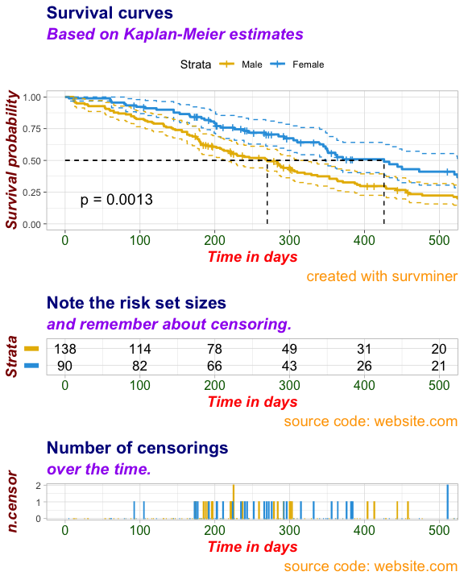
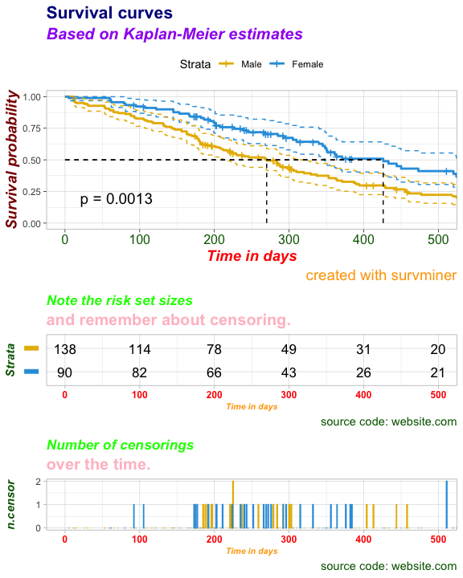

[](https://travis-ci.org/kassambara/survminer) [](https://cran.r-project.org/package=survminer) [](https://cran.r-project.org/package=survminer) [](http://cranlogs.r-pkg.org/badges/grand-total/survminer)

<br/>

-   [survminer: Survival Analysis and Visualization](#survminer-survival-analysis-and-visualization)
    -   [Installation and loading](#installation-and-loading)
    -   [ggsurvplot: Drawing survival curves](#ggsurvplot-drawing-survival-curves)
        -   [Fitting survival curves](#fitting-survival-curves)
        -   [Basic plots](#basic-plots)
        -   [Computing and passing p-values](#computing-and-passin-p-values)
        -   [Customized survival curves](#customized-survival-curves)
        -   [More customized survival curves](#more-customized-survival-curves)
        -   [Uber customized survival curves](#uber-customized-survival-curves)
        -   [Uber platinum customized survival curves](#uber-platinum-customized-survival-curves)
        -   [Uber platinum premium customized survival curves](#uber-platinum-premium-customized-survival-curves)
    -   [Blog posts](#blog-posts)

survminer: Survival Analysis and Visualization
==============================================

The **survminer** R package provides functions for facilitating **survival analysis** and **visualization**.

The main functions, in the package, are organized in different categories as follow.

**Survival Curves**
<hr/>
<br/>

-   **ggsurvplot**(): Draws survival curves with the 'number at risk' table, the cumulative number of events table and the cumulative number of censored subjects table.

-   **arrange\_ggsurvplots**(): Arranges multiple ggsurvplots on the same page.

-   **ggsurvevents**(): Plots the distribution of event's times.

-   **surv\_summary**(): Summary of a survival curve. Compared to the default summary() function, surv\_summary() creates a data frame containing a nice summary from survfit results.

-   **surv\_cutpoint**(): Determines the optimal cutpoint for one or multiple continuous variables at once. Provides a value of a cutpoint that correspond to the most significant relation with survival.

-   **pairwise\_survdiff**(): Multiple comparisons of survival curves. Calculate pairwise comparisons between group levels with corrections for multiple testing.

<br/>

**Diagnostics of Cox Model**
<hr/>
<br/>

-   **ggcoxzph**(): Graphical test of proportional hazards. Displays a graph of the scaled Schoenfeld residuals, along with a smooth curve using ggplot2. Wrapper around plot.cox.zph().

-   **ggcoxdiagnostics**(): Displays diagnostics graphs presenting goodness of Cox Proportional Hazards Model fit.

-   **ggcoxfunctional**(): Displays graphs of continuous explanatory variable against martingale residuals of null cox proportional hazards model. It helps to properly choose the functional form of continuous variable in cox model.

<br/>

**Summary of Cox Model**
<hr/>
<br/>

-   **ggforest**(): Draws forest plot for CoxPH model.

-   **ggcoxadjustedcurves**(): Plots adjusted survival curves for coxph model.

<br/>

**Competing Risks**
<hr/>
<br/>

-   **ggcompetingrisks**(): Plots cumulative incidence curves for competing risks.

<br/>

> Find out more at <http://www.sthda.com/english/rpkgs/survminer/>, and check out the documentation and usage examples of each of the functions in survminer package.

Installation and loading
------------------------

Install from [CRAN](https://cran.r-project.org/package=survminer) as follow:

``` r
install.packages("survminer")
```

Or, install the latest version from [GitHub](https://github.com/kassambara/survminer):

``` r
if(!require(devtools)) install.packages("devtools")
devtools::install_github("kassambara/survminer", build_vignettes = FALSE)
```

Load survminer:

``` r
library("survminer")
```

ggsurvplot: Drawing survival curves
-----------------------------------

### Fitting survival curves

``` r
require("survival")
fit <- survfit(Surv(time, status) ~ sex, data = lung)
```

### Basic plots

``` r
ggsurvplot(fit, data = lung)
```



Censor shape can be changed as follow:

``` r
ggsurvplot(fit, data = lung, censor.shape="|", censor.size = 4)
```

### Customized survival curves

``` r
ggsurvplot(
  fit, 
  data = lung, 
  size = 1,                 # change line size
  palette = 
    c("#E7B800", "#2E9FDF"),# custom color palettes
  conf.int = TRUE,          # Add confidence interval
  pval = TRUE,              # Add p-value
  risk.table = TRUE,        # Add risk table
  risk.table.col = "strata",# Risk table color by groups
  legend.labs = 
    c("Male", "Female"),    # Change legend labels
  risk.table.height = 0.25, # Useful to change when you have multiple groups
  ggtheme = theme_bw()      # Change ggplot2 theme
)
```



Note that, additional arguments are available to customize the main title, axis labels, the font style, axis limits, legends and the number at risk table.

### More customized survival curves

Focus on `xlim` and `break.time.by` parameters which do not change the calculations of estimates of survival surves. Also note `risk.table.y.text.col = TRUE` and `risk.table.y.text = FALSE` that provide bars instead of names in text annotations of the legend of risk table.

``` r
ggsurvplot(
   fit,                     # survfit object with calculated statistics.
   data = lung,             # data used to fit survival curves.
   risk.table = TRUE,       # show risk table.
   pval = TRUE,             # show p-value of log-rank test.
   conf.int = TRUE,         # show confidence intervals for 
                            # point estimates of survival curves.
   xlim = c(0,500),         # present narrower X axis, but not affect
                            # survival estimates.
   xlab = "Time in days",   # customize X axis label.
   break.time.by = 100,     # break X axis in time intervals by 500.
   ggtheme = theme_light(), # customize plot and risk table with a theme.
 risk.table.y.text.col = T, # colour risk table text annotations.
  risk.table.y.text = FALSE # show bars instead of names in text annotations
                            # in legend of risk table
)
```



### Uber customized survival curves

``` r
ggsurv <- ggsurvplot(
           fit,                     # survfit object with calculated statistics.
           data = lung,             # data used to fit survival curves.
           risk.table = TRUE,       # show risk table.
           pval = TRUE,             # show p-value of log-rank test.
           conf.int = TRUE,         # show confidence intervals for 
                                    # point estimates of survival curves.
           palette = c("#E7B800", "#2E9FDF"),
           xlim = c(0,500),         # present narrower X axis, but not affect
                                    # survival estimates.
           xlab = "Time in days",   # customize X axis label.
           break.time.by = 100,     # break X axis in time intervals by 500.
           ggtheme = theme_light(), # customize plot and risk table with a theme.
          risk.table.y.text.col = T,# colour risk table text annotations.
          risk.table.height = 0.25, # the height of the risk table
          risk.table.y.text = FALSE,# show bars instead of names in text annotations
                                    # in legend of risk table.
          ncensor.plot = TRUE,      # plot the number of censored subjects at time t
          ncensor.plot.height = 0.25,
          conf.int.style = "step",  # customize style of confidence intervals
          surv.median.line = "hv",  # add the median survival pointer.
          legend.labs = 
            c("Male", "Female")    # change legend labels.
        )
ggsurv
```



### Uber platinum customized survival curves

``` r
# Changing Labels
# %%%%%%%%%%%%%%%%%%%%%%%%%%
# Labels for Survival Curves (plot)
ggsurv$plot <- ggsurv$plot + labs(
  title    = "Survival curves",                     
  subtitle = "Based on Kaplan-Meier estimates",  
  caption  = "created with survminer"             
  )

# Labels for Risk Table 
ggsurv$table <- ggsurv$table + labs(
  title    = "Note the risk set sizes",          
  subtitle = "and remember about censoring.", 
  caption  = "source code: website.com"        
  )

# Labels for ncensor plot 
ggsurv$ncensor.plot <- ggsurv$ncensor.plot + labs( 
  title    = "Number of censorings", 
  subtitle = "over the time.",
  caption  = "source code: website.com"
  )

# Changing the font size, style and color
# %%%%%%%%%%%%%%%%%%%%%%%%%%%%%%%%%%%%%%%
# Applying the same font style to all the components of ggsurv:
# survival curves, risk table and censor part

ggsurv <- ggpar(
  ggsurv,
  font.title    = c(16, "bold", "darkblue"),         
  font.subtitle = c(15, "bold.italic", "purple"), 
  font.caption  = c(14, "plain", "orange"),        
  font.x        = c(14, "bold.italic", "red"),          
  font.y        = c(14, "bold.italic", "darkred"),      
  font.xtickslab = c(12, "plain", "darkgreen"),
  legend = "top"
)

ggsurv
```



Uber platinum premium customized survival curves
------------------------------------------------

``` r
# Using specific fonts for risk table and ncensor plots
#%%%%%%%%%%%%%%%%%%%%%%%%%%%%%%%%%%%%%%%%%%%%%%%%%%%%%%%%%%%
# Font for Risk Table
ggsurv$table <- ggpar(
  ggsurv$table,
  font.title    = c(13, "bold.italic", "green"),
  font.subtitle = c(15, "bold", "pink"),
  font.caption  = c(11, "plain", "darkgreen"),
  font.x        = c(8, "bold.italic", "orange"),
  font.y        = c(11, "bold.italic", "darkgreen"),
  font.xtickslab = c(9, "bold", "red")
)


# Font for ncensor plot
ggsurv$ncensor.plot <- ggpar(
  ggsurv$ncensor.plot,
  font.title    = c(13, "bold.italic", "green"),
  font.subtitle = c(15, "bold", "pink"),
  font.caption  = c(11, "plain", "darkgreen"),
  font.x        = c(8, "bold.italic", "orange"),
  font.y        = c(11, "bold.italic", "darkgreen"),
  font.xtickslab = c(9, "bold", "red")
)

print(ggsurv)
```



Blog posts
----------

-   M. Kosiński. R-ADDICT January 2017. [Comparing (Fancy) Survival Curves with Weighted Log-rank Tests](http://r-addict.com/2017/02/09/Fancy-Survival-Plots.html)

-   M. Kosiński. R-ADDICT January 2017. [When You Went too Far with Survival Plots During the survminer 1st Anniversary](http://r-addict.com/2017/01/15/Too-Far-With-Survival-Plots.html)

-   A. Kassambara. STHDA December 2016. [Survival Analysis Basics: Curves and Logrank Tests](http://www.sthda.com/english/wiki/survival-analysis-basics)

-   A. Kassambara. STHDA December 2016. [Cox Proportional Hazards Model](http://www.sthda.com/english/wiki/cox-proportional-hazards-model)

-   A. Kassambara. STHDA December 2016. [Cox Model Assumptions](http://www.sthda.com/english/wiki/cox-model-assumptions)

-   M. Kosiński. R-ADDICT November 2016. [Determine optimal cutpoints for numerical variables in survival plots](http://r-addict.com/2016/11/21/Optimal-Cutpoint-maxstat.html)

-   M. Kosiński. R-ADDICT May 2016. [Survival plots have never been so informative](http://r-addict.com/2016/05/23/Informative-Survival-Plots.html)

-   A. Kassambara. STHDA January 2016. [survminer R package: Survival Data Analysis and Visualization](http://www.sthda.com/english/wiki/survminer-r-package-survival-data-analysis-and-visualization).
